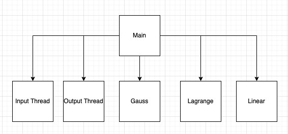
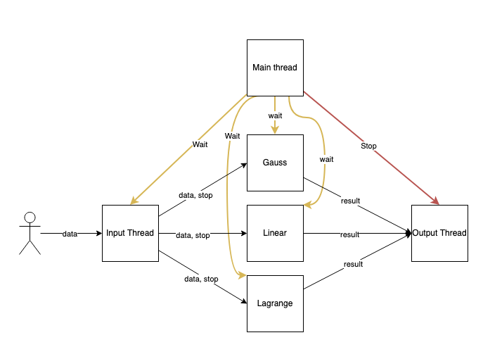

Лабораторная работа №3

Вариант: 

Цель: получить навыки работы с вводом/выводом, потоковой обработкой данных, командной строкой.

В рамках лабораторной работы вам предлагается повторно реализовать лабораторную работу по предмету "Вычислительная математика" посвящённую аппроксимации (в разные годы это лабораторная работа 3 или 4) со следующими дополнениями:

- обязательно должна быть реализована линейная интерполяция (отрезками, [link](https://en.wikipedia.org/wiki/Linear_interpolation));
- настройки алгоритма аппроксимирования и выводимых данных должны задаваться через аргументы командной строки:
   - какие алгоритмы использовать (в том числе два сразу);
   - частота дискретизации результирующих данных;
   - и т.п.;
- входные данные должны задаваться в текстовом формате на подобии ".csv" (к примеру `x;y\n` или `x\ty\n`) и подаваться на стандартный ввод, входные данные должны быть отсортированы по возрастанию x;
- выходные данные должны подаваться на стандартный вывод;
- программа должна работать в потоковом режиме (пример -- `cat | grep 11`), это значит, что при запуске программы она должна ожидать получения данных на стандартный ввод, и, по мере получения достаточного количества данных, должна выводить рассчитанные точки в стандартный вывод;

Приложение должно быть организовано следующим образом:

```text
    +---------------------------+
    | обработка входного потока |
    +---------------------------+
            |
            | поток / список / последовательность точек
            v
    +------------------------+      +------------------------------+
    | алгоритм аппроксимации |<-----| генератор точек, для которых |
    +------------------------+      | необходимо вычислить         |
            |                       | аппроксимированное значение   |
            |                       +------------------------------+
            |
            | поток / список / последовательность рассчитанных точек
            v
    +------------------------+
    | печать выходных данных |
    +------------------------+
```

Потоковый режим для алгоритмов, работающих с группой точек должен работать следующим образом:

```text
o o o o o o . . x x x
  x x x . . o . . x x x
    x x x . . o . . x x x
      x x x . . o . . x x x
        x x x . . o . . x x x
          x x x . . o . . x x x
            x x x . . o o o o o o EOF
```

где:

- каждая строка -- окно данных, на основании которых производится расчёт алгоритма;
- строки сменяются по мере поступления в систему новых данных (старые данные удаляются из окна, новые -- добавляются);
- `o` -- рассчитанные данные, можно видеть:
   - большинство окон используется для расчёта всего одной точки, так как именно в "центре аппроксимации" результат наиболее точен;
   - первое и последнее окно используются для расчёта большого количества точек, так лучших данных для расчёта у нас не будет.
- `x` -- точки, расчёт которых для "окон" не требуется.

Общие требования:

- программа должна быть реализована в функциональном стиле;
- ввод/вывод должен быть отделён от алгоритмов аппроксимации;
- требуется использовать идиоматичный для технологии стиль программирования.

Содержание отчёта:

- титульный лист;
- требования к разработанному ПО, включая описание алгоритма;
- ключевые элементы реализации с минимальными комментариями;
- ввод/вывод программы;
- выводы (отзыв об использованных приёмах программирования).

Общие рекомендации по реализации. Не стоит писать большие и страшные автоматы, управляющие поведением приложения в целом. Если у вас:

- Язык с ленью -- используйте лень.
- Языки с параллельным программированием и акторами -- используйте их.
- Язык без всей этой прелести -- используйте генераторы/итераторы/и т.п.


---

## Выполнение

#### Дерево потоков


#### Схема работы


- Точка входа в программу: [src/main.erl](src/main.erl)
- Линейная интерполяция: [src/linear.erl](src/linear.erl)
- Метод Лагранжа: [src/lagrange.erl](src/lagrange.erl)
- Метод Гаусса: [src/gauss.erl](src/gauss.erl)
- Работа с вводом: [src/input.erl](src/input.erl)
- Работа с выводом: [src/output.erl](src/output.erl)

### Примеры работы

#### Конвейерная обработка
```text
./main.erl -s 0.2 -m gauss -m linear -m lagrange < input.txt
Gauss:
1.200   1.400   1.600   1.800   2.000
2.200   2.400   2.600   2.800   3.000
Linear:
1.200   1.400   1.600   1.800   2.000
2.200   2.400   2.600   2.800   3.000
Lagrange:
1.200   1.400   1.600   1.800   2.000
2.200   2.400   2.600   2.800   3.000
Linear:
2.200   2.400   2.600   2.800   3.000
3.200   3.400   3.600   3.800   4.000
Lagrange:
1.200   1.400   1.600   1.800   2.000   2.200   2.400   2.600   2.800   3.000
2.200   2.400   2.600   2.800   3.000   3.200   3.400   3.600   3.800   4.000
Linear:
3.200   3.400   3.600   3.800   4.000
4.200   4.400   4.600   4.800   5.000
Gauss:
1.200   1.400   1.600   1.800   2.000   2.200   2.400   2.600   2.800   3.000
2.200   2.400   2.600   2.800   3.000   3.200   3.400   3.600   3.800   4.000
Lagrange:
1.200   1.400   1.600   1.800   2.000   2.200   2.400   2.600   2.800   3.000   3.200   3.400   3.600   3.800   4.000
2.200   2.400   2.600   2.800   3.000   3.200   3.400   3.600   3.800   4.000   4.200   4.400   4.600   4.800   5.000
Linear:
4.200   4.400   4.600   4.800   5.000
5.100   5.200   5.300   5.400   5.500
...
```

Интерактивная обработка
```text
./main.erl -s 0.2 -m gauss -m linear -m lagrange            
1 2
3 4
Linear:
1.200   1.400   1.600   1.800   2.000   2.200   2.400   2.600   2.800   3.000
2.200   2.400   2.600   2.800   3.000   3.200   3.400   3.600   3.800   4.000
Lagrange:
1.200   1.400   1.600   1.800   2.000   2.200   2.400   2.600   2.800   3.000
2.200   2.400   2.600   2.800   3.000   3.200   3.400   3.600   3.800   4.000
Gauss:
1.200   1.400   1.600   1.800   2.000   2.200   2.400   2.600   2.800   3.000
2.200   2.400   2.600   2.800   3.000   3.200   3.400   3.600   3.800   4.000
4 5
Linear:
3.200   3.400   3.600   3.800   4.000
4.200   4.400   4.600   4.800   5.000
Lagrange:
1.200   1.400   1.600   1.800   2.000   2.200   2.400   2.600   2.800   3.000   3.200   3.400   3.600   3.800   4.000
2.200   2.400   2.600   2.800   3.000   3.200   3.400   3.600   3.800   4.000   4.200   4.400   4.600   4.800   5.000
Gauss:
1.200   1.400   1.600   1.800   2.000   2.200   2.400   2.600   2.800   3.000   3.200   3.400   3.600   3.800   4.000
2.245   2.480   2.705   2.920   3.125   3.320   3.505   3.680   3.845   4.000   4.145   4.280   4.405   4.520   4.625
5 6
Linear:
4.200   4.400   4.600   4.800   5.000
5.200   5.400   5.600   5.800   6.000
Lagrange:
1.200   1.400   1.600   1.800   2.000   2.200   2.400   2.600   2.800   3.000   3.200   3.400   3.600   3.800   4.000   4.200   4.400   4.600   4.800   5.000
2.200   2.400   2.600   2.800   3.000   3.200   3.400   3.600   3.800   4.000   4.200   4.400   4.600   4.800   5.000   5.200   5.400   5.600   5.800   6.000
Gauss:
1.200   1.400   1.600   1.800   2.000   2.200   2.400   2.600   2.800   3.000   3.200   3.400   3.600   3.800   4.000   4.200   4.400   4.600   4.800   5.000
3.376   3.551   3.712   3.861   4.000   4.128   4.248   4.359   4.464   4.563   4.656   4.745   4.832   4.917   5.000   5.083   5.168   5.255   5.344   5.438

```

#### Потоковая обработка
```text
cat | ./main.erl -s 0.2 -m gauss -m linear -m lagrange
1 2
3 4
Linear:
1.200   1.400   1.600   1.800   2.000   2.200   2.400   2.600   2.800   3.000
2.200   2.400   2.600   2.800   3.000   3.200   3.400   3.600   3.800   4.000
Lagrange:
1.200   1.400   1.600   1.800   2.000   2.200   2.400   2.600   2.800   3.000
2.200   2.400   2.600   2.800   3.000   3.200   3.400   3.600   3.800   4.000
Gauss:
1.200   1.400   1.600   1.800   2.000   2.200   2.400   2.600   2.800   3.000
2.200   2.400   2.600   2.800   3.000   3.200   3.400   3.600   3.800   4.000
```

## Выводы

Реализовал методы интерполяции на Erlang в необычном для себя виде: в интерактивном, потоковом и конвейрном виде. Работа с числами в Erlang неудобная, но работа с потоками радует.

