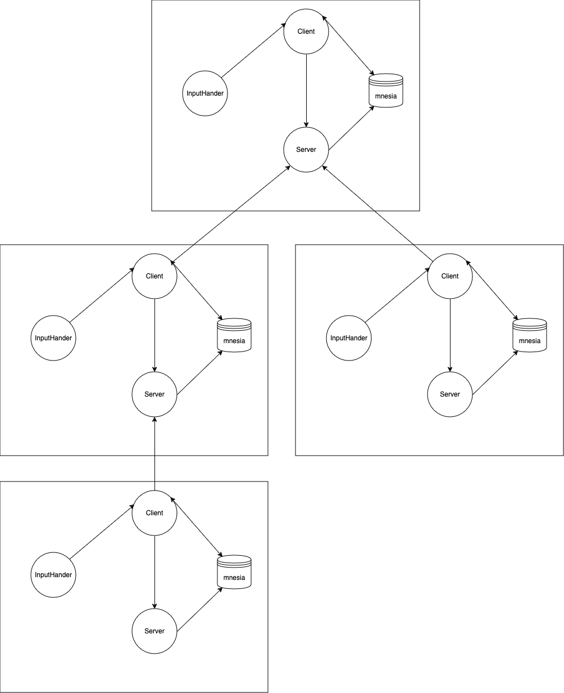
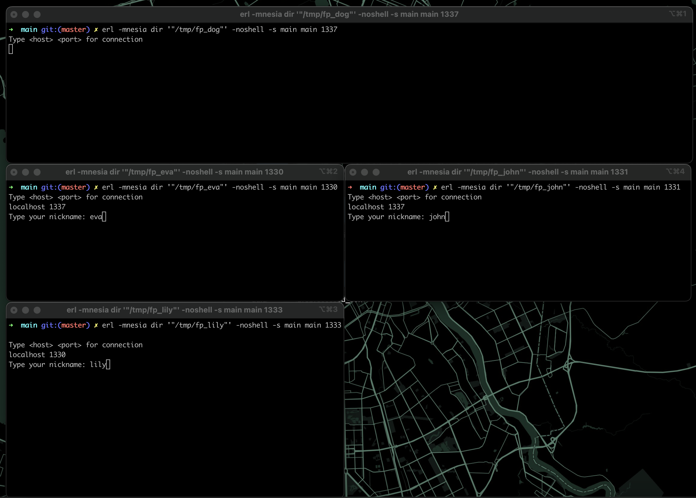
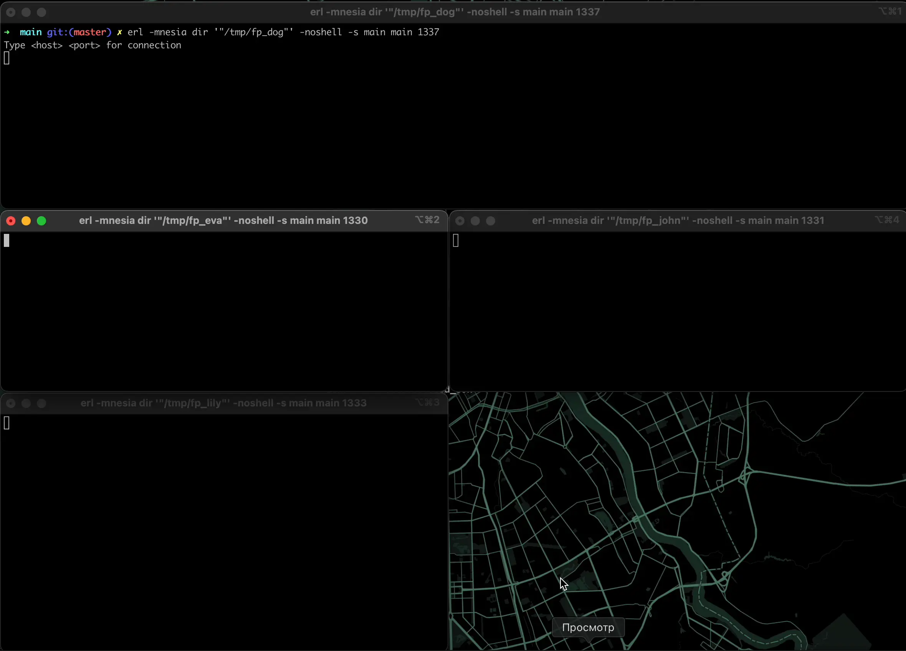
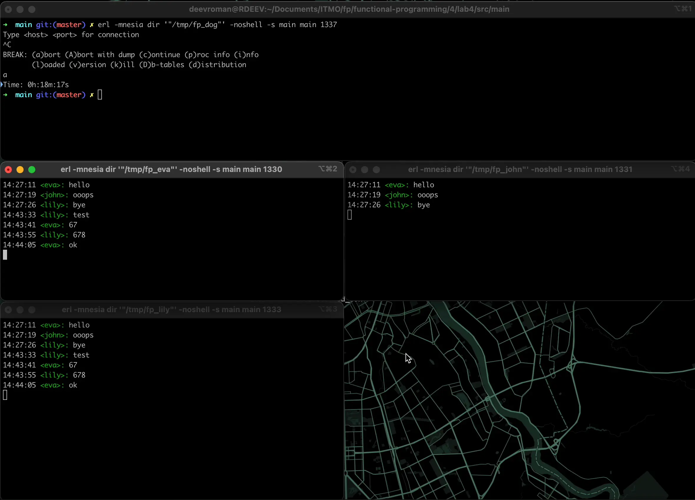

### Лабораторная работа №4

Вариант: p2p чат с группами ~~и консольным интерфейсом~~

Цель: получить навыки работы со специфичными для выбранной технологии/языка программирования приёмами.

Вариант лабораторной работы назначается в зависимости от выбранной технологии. Вы можете предложить свой вариант задания, в том числе и групповой.

<details>

<summary>Варианты:</summary> 


1. eDSL (embedded Domain Specific Language) для конечных автоматов. eDSL должен позволять в явном виде описывать невозможные/игнорируемые переходы между состояниями. eDSL должен быть запускаемым и генерирующим описание в формате dot (подробнее см. проект graphviz). С использованием разработанного eDSL реализовать модель (одна из, определяется вариантом задания):
  1. Лифта. При движении вниз - подбирать людей.
  2. Светофора. Перекрёсток с главной дорогой и пешеходной кнопкой.

2. eDSL для описания графов вычислительного процесса с моделью вычислений: Synchronized Data Flow. eDSL должен быть запускаемым и генерирующим описание в формате dot (подробнее см. проект graphviz). Невозможность расчёта одной из вершин (деление на ноль) не должна приводить к общему сбою. С использованием данного eDSL реализовать алгоритм расчёта корней квадратного уравнения.

   Пример графа вычислительного процесса, где на один запуск на вход подаются `a` и `b`, а в процессе вычисления получается `c` и `d`:

    ```text
            a   +------+         +------+
        ------->|      |    c    |      |   d
                |  a+b |-------->|  2/c |------->
            b   |      |         |      |
        ------->|      |         |      |
                +------+         +------+
    ```

3. Библиотека парсер комбинаторов. С разработанной библиотекой парсер комбинаторов реализовать:
  1. Парсер json.
  2. Потоковый парсер csv.

4. Библиотека для централизованного журналирования работы распределённой системы. С разработанной библиотекой реализовать: ping/pong сервер.

5. eDSL реализующий оператор `for` языка go lang на макросах.

6. eDSL для программирования чат-ботов.

7. Написать что-нибудь на F# [парсер комбинаторах](https://fsharpforfunandprofit.com/series/understanding-parser-combinators/), например свой DSL или парсер какого-нибудь не слишком сложного языка.

8. Написать [UI тесты/автоматизацию](https://lefthandedgoat.github.io/canopy/) на F# для вашего любимого сайта

9. Написать собственный [F# Type Provider](https://docs.microsoft.com/en-us/dotnet/fsharp/tutorials/type-providers/) (можно скомбинировать с парсер комбинаторами и брать типы, например, из объявлений какого-нибудь не слишком сложного языка)

10. Библиотека для работы с физическими величинами (языки со статической типизацией и multiple dispatch):

  - статическая проверка (не складывать килограммы и метры);
  - автоматический вывод типов (делим метры на минуты и получаем километры в час);
  - и т.п.

Другие примеры возможных заданий:

- система управления вычислениями на кластере (Erlang/OTP)
- система распределённого хранения данных (Erlang/OTP)
- peer2peer сервис чатов с шифрованием и хранением истории
- тактовая модель процессора и транслятор в машинный язык (Haskell)
- eDSL для разработки и анализа конечных автоматов (Haskell)
- разработка eDSL для описания разметки оконного интерфейса (Lisp)
- библиотека парсер-комбинаторов и eDSL фронтенд (Lisp)
- Web framework (Common Lisp / CLOS)
- библиотека для маршалинга данных
- разработка алгоритмов обработки данных и формальное доказательство их корректности (Coq)
- объёмная задача проекта <https://ryukzak.github.io/projects/nitta/> (Haskell)
- практически любая другая сложная и интересная задача (можете попробовать найти пересечение с другими предметами).

</details>

Общие требования:

- программа должна быть реализована в функциональном стиле;
- требуется использовать идиоматичный для технологии стиль программирования;
- задание и коллектив должны быть согласованы;
- допустима совместная работа над одним заданием.

Содержание отчёта:

- титульный лист;
- требования к разработанному ПО, включая описание алгоритма;
- реализация с минимальными комментариями;
- ввод/вывод программы;
- выводы (отзыв об использованных приёмах программирования).


---

## Выполнение

### Идея

Для настоящего p2p у нас не должно быть центрального сервера. Поэтому каждый участник сети будет и клиентом, и сервером, к которому будут подключаться другие участники. Т.е. пользователь запускает чат и сначала открывает порт, а после решает нужно ли ему подключаться к другому участнику. 

Пример соединения между участниками:


Воссозданим эту сеть:


Пробуем посылать сообщения:


Отключим корневой узел и проверим работу:


У оставшихся в поддереве пользователей связь остаётся


## Выводы

Реализовал простой p2p-чат на Erlang. Немного разочаровало отсутствие TUI-библиотек для Erlang и невозможность заиспользовать подобную библиотеку из Elixir несмотря появившуюся возможность это делать (библиотека крашится).

Хоть я не заиспользовал библиотеки для TUI, я узнал как в целом работают интерактивные приложения. Что терминалы можно переключить в режим raw и вручную обрабатывать все нажатия клавиш пользователя. А также узнал в общих чертах, как симулировать интерфейс в терминале.

По Erlang'у остались противоречивые чувства. Идея классная, язык минималистичный. Но вот тулинг вокруг языка очень разочаровал. Начиная от сломанных плагинов и отладчиков в разных IDE и редактор, заканчивая rebar3, который небольшими опечатками в конфиге удаётся крашить `¯\_(ツ)_/¯`.

Elixir в этом плане выглядит более привлекательным. Например, из-за развивающиеся системы типов https://elixir-lang.org/blog/2022/10/05/my-future-with-elixir-set-theoretic-types/

С другой стороны для своего времени язык получился неплохой. Поработать с параллельным программированием без мьютексов и в котором данные сложно покорраптить из-за отсутствия разделяемой памяти было интересно.  

